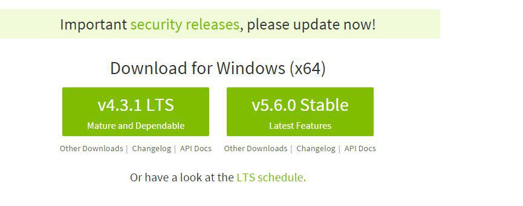

## Tarea Inicial

Configuración de las herramientas y tecnologías a utilizar en la asignatura Sistemas y Tecnologías Webs.

* NodeJS

Para instalar ** *NodeJS* ** se ha accedido a la
[página oficial de nodeJS](https://nodejs.org/en/)
 donde se ha encontrado dos versiones, una estable y la ultima version reciente.Se instaló la versión estable.

Para el desarrollo de la práctica instalaremos la última versión reciente para asegurarnos la disponibilidad de sus servicios.

* Comprobación de **correcto funcionamiento de npm**:

Para comprobar el correcto funcionamiento de npm hemos ejecutado el comando : * **npm version** *. Tras la correcta ejecución del mismo damos por adecuada la intrepretación de comandos en el mismo.

* Express

Para instalar Express se ha introducido el comando en el cmd de windows npm install ** *express --save* **, se incluyela opción ** *--save* ** para que se guarde de forma permanente en la lista de dependencias.

* Cambio de la **foto de perfil** (Campus virtual)

* Atom

Para instalar Atom se ha accedido a la [página oficial de Atom](https://atom.io/) y se descargó e instaló.

* GitHub

Para instalar Github APP en windows se ha accedido a la [página oficial ](https://desktop.github.com/) e se instaló la version de desktop que nos permite trabajar con una interfaz

* Cloud9

Como ya se tiene una cuenta creada en Cloud9 (realizado en otras asignaturas) vinculamos la existente con GitHub:

* Pandoc

Para instalar ** *pandoc* ** se ha accedido al siguiente enlace [ pandoc](https://github.com/jgm/pandoc/releases/tag/1.16.0.2) y se descargó el ** *msi* ** (versión ejecutable para windows) 

* Markdown

Para traducir de ** *markdown* ** a html hemos utilizado pandoc
con el siguiente comando

[Página personal de prácticas](http://alu0100536652.github.io/)

[Página de la práctica inicial](http://alu0100536652.github.io/Tutorial-STW/)
