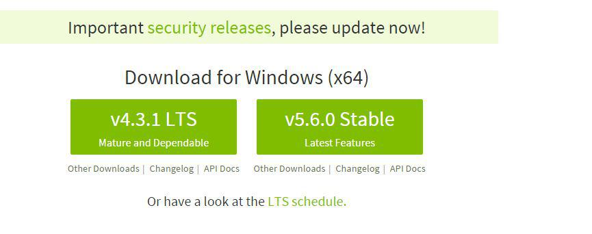
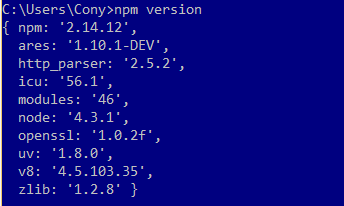
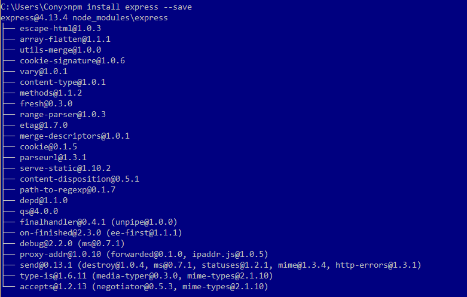
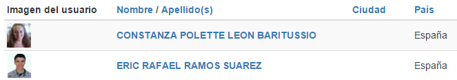
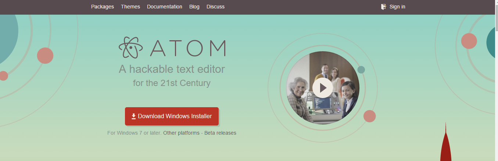
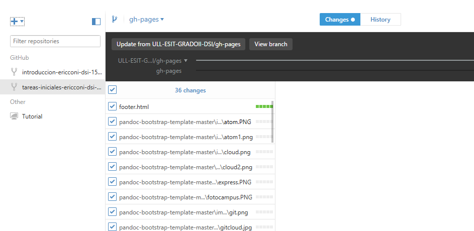
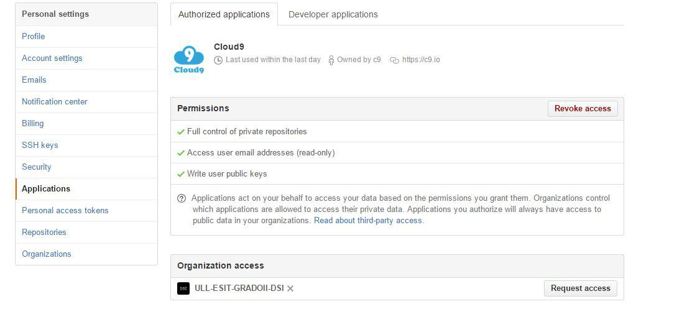
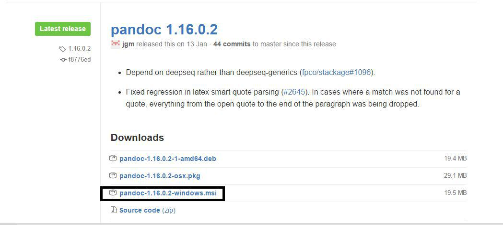
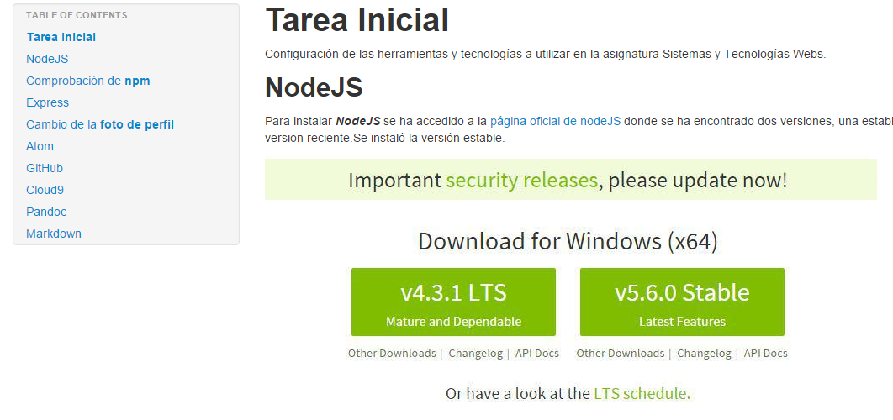

**Tarea Inicial**
======================================================
Configuración de las herramientas y tecnologías a utilizar en la asignatura Sistemas y Tecnologías Webs.


## NodeJS

Para instalar ***NodeJS*** se ha accedido a la
[página oficial de nodeJS](https://nodejs.org/en/)
 donde se ha encontrado dos versiones, una estable y la ultima version reciente.Se instaló la versión estable.

Para el desarrollo de la práctica instalaremos la última versión reciente para asegurarnos la disponibilidad de sus servicios.

## Comprobación de **npm**

Para comprobar el correcto funcionamiento de npm hemos ejecutado el comando : ```npm version```. Tras la correcta ejecución del mismo damos por adecuada la intrepretación de comandos en el mismo.



## Express

Para instalar Express se ha introducido el comando en el cmd de windows npm install ```express --save```, se incluyela opción ```--save``` para que se guarde de forma permanente en la lista de dependencias.



## Cambio de la **foto de perfil**



## Atom

Para instalar Atom se ha accedido a la [página oficial de Atom](https://atom.io/) y se ha descargado la versión compatible con el sistema operativo.




## GitHub

Para instalar Github APP en windows se ha accedido a la [página oficial ](https://desktop.github.com/) e se instaló la version de desktop que nos permite trabajar con una interfaz


Una vez instalado el mismo podremos trabajar con los respositorios vinculados a nuestra cuenta de GitHub, así como crear, clonar los mismos y trabajar con múltiples ramas mediante una interfaz gráfica.



## Cloud9

Como ya se tiene una cuenta creada en Cloud9 (realizado en otras asignaturas) vinculamos la existente con GitHub:



## Pandoc

Para instalar ***pandoc*** se ha accedido al siguiente enlace [ pandoc](https://github.com/jgm/pandoc/releases/tag/1.16.0.2) y se descargó el ***msi*** (versión ejecutable para windows) 


Para traducir de ***markdown*** a html hemos utilizado pandoc
con un template de bootstrap localizado en esta  [dirección](https://github.com/tonyblundell/pandoc-bootstrap-template) para la utilización del mismo se ha descargado el repositorio y se ha utilizado este comando:

    pandoc tutorial.md -o index.html --template template.html --css template.css --self-contained --toc

El comando incluye una opción -- toc que nos permite visualizar una tabla de contenido. El resultado obtenido es el siguiente.



Puedes encontrar la página [aquí](http://alu0100786330.github.io/tareas-iniciales-ericconi-dsi-1516/)

## Markdown

Para el desarrollo de este documento se ha utilizado Markdown. Aquí las multiples opciones que ofrece este lenguaje.

    # Encabezado h1
    ## Encabezado h2
    ### Encabezado h3
    #### Encabezado h4
    ##### Encabezado h5
    ###### Encabezado h6
    Citas: Para citar solo es necesario escribir una cuña antes del texto

    > La vida es muy corta para aprender Alemán. -Tad Marburg
    Texto con énfasis: Agregar un asterisco para cursiva y dos para negrita

     *énfasis* (cursiva)

     **énfasis fuerte** (negrita)
    Código: Se utiliza el acento grave para identificar código

     `Código`
     ```
     Código en
     varias líneas
     ```
    Listas:

     * Un elemento en una lista no ordenada
     * Otro elemento en una lista
     1. Elemento en una lista enumerada u ordenada.
     2. Otro elemento
    Enlaces:

     [Texto del enlace aquí](URL "Título del enlace")
